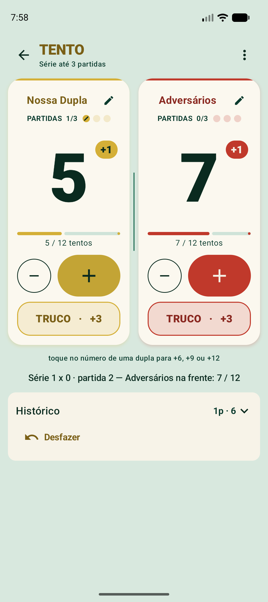
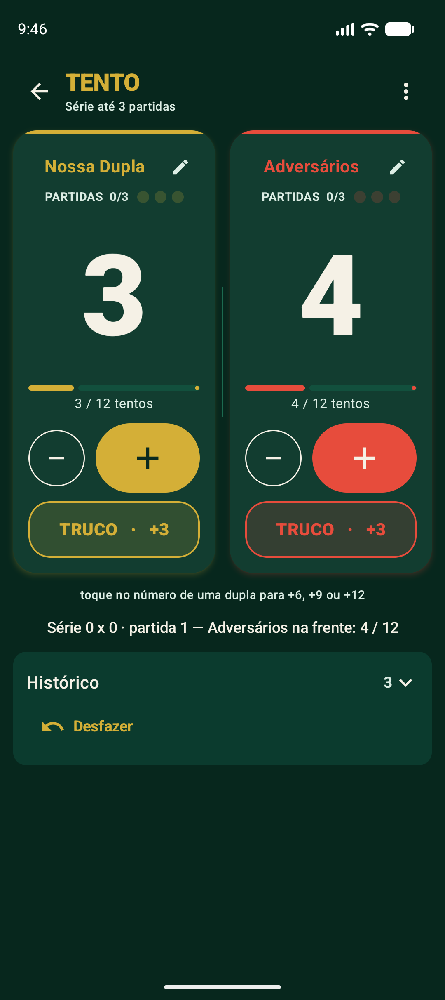
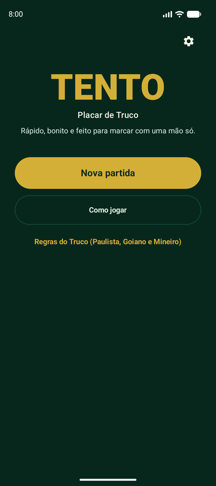
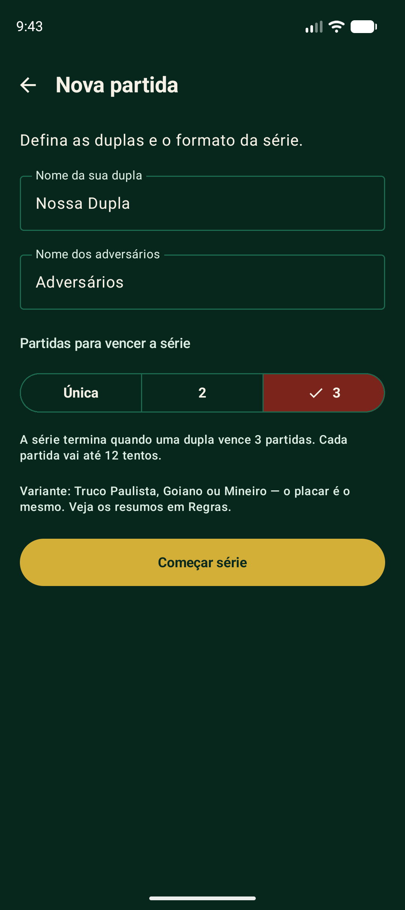
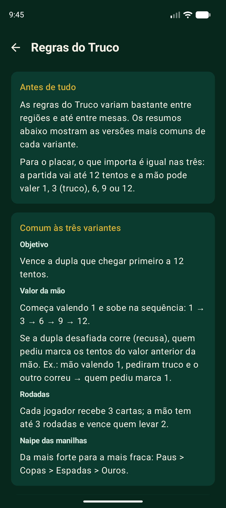
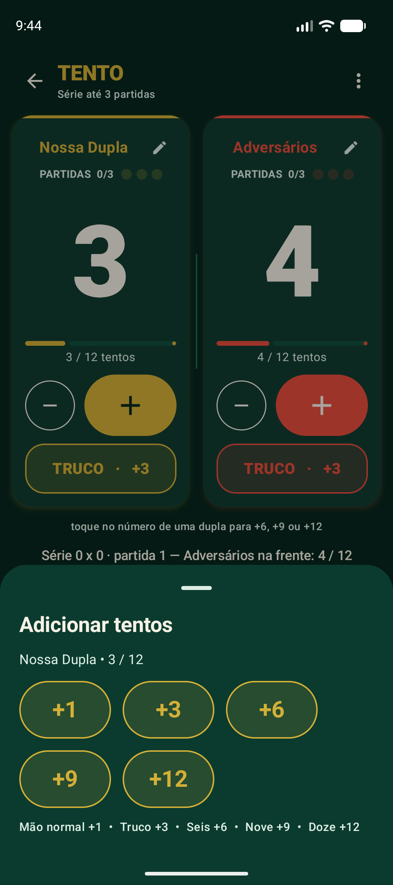
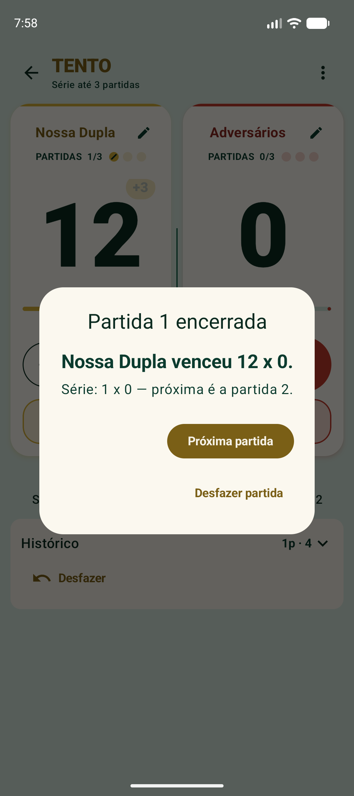
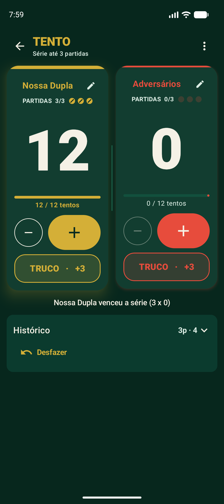

<div align="center">

# 🃏 Tento — Placar de Truco

**Contador digital de tentos para partidas presenciais de Truco.**
Rápido, bonito e feito para marcar com uma mão só.


&nbsp;


</div>

---

## O que é

**Tento** substitui o marcador físico do Truco (o risquinho na mesa) por um placar
digital. Ele **não** simula o jogo de cartas, não distribui cartas e não joga
contra o celular — a única função é **contar os tentos** de forma que dê para
marcar em menos de um segundo, com o celular no centro da mesa.

### Recursos

- **Duas duplas** com nome editável, placar gigante e progresso até 12.
- **Botão `TRUCO · +3`** dedicado, além de `+` / `−` e um menu rápido
  `+1 / +3 / +6 / +9 / +12` (com confirmação quando passaria de 12).
- **Série "melhor de N"**: vence quem ganhar primeiro **1, 2 ou 3** partidas de 12
  tentos. Placar de partidas com bolinhas embaixo de cada dupla.
- **Histórico** da série (partidas concluídas + lançamentos da partida atual) e
  **Desfazer** — que até reabre a última partida encerrada para corrigir um toque
  errado.
- **Persistência total**: fechou o app, reabriu, continua exatamente de onde parou.
- **Tela de Regras** com os resumos de **Truco Paulista, Goiano e Mineiro**, e um
  "Como jogar" curtinho.
- **Tema claro e escuro**, vibração e sons configuráveis, acessibilidade (TalkBack,
  alvos grandes, nada depende só de cor).
- **100% offline** — sem backend, sem login, sem cadastro, sem anúncios, sem
  permissões perigosas.

---

## Telas

| Início | Nova partida | Regras |
|:--:|:--:|:--:|
|  |  |  |

| Menu rápido de tentos | Fim de partida | Série vencida |
|:--:|:--:|:--:|
|  |  |  |

---

## Como a série funciona

Ao criar a partida você escolhe o formato:

| Formato | Vence a série quem… |
|--|--|
| **Única** | ganhar 1 partida de 12 tentos |
| **2** | ganhar 2 partidas primeiro |
| **3** (padrão) | ganhar 3 partidas primeiro |

- Cada partida vai até **12 tentos** (mão normal `+1`, truco `+3`, seis `+6`,
  nove `+9`, doze `+12`).
- Ao chegar a 12, a partida é registrada no histórico e **continua à vista** até
  você tocar em **"Próxima partida"** — assim o diálogo de fim e o placar por
  baixo mostram o mesmo número.
- **"Desfazer"** tira o último tento; se a partida atual já está zerada, ele
  **reabre a última partida encerrada** (e "des-encerra" a série, se for o caso).

---

## Tecnologias

- **Kotlin 2.2** · **Jetpack Compose** · **Material 3**
- **Gradle Kotlin DSL**, **AGP 9** (Kotlin embutido no AGP) + plugin
  `org.jetbrains.kotlin.plugin.compose`
- `androidx.datastore:datastore-preferences` para persistência
- `androidx.lifecycle` — `ViewModel` + `StateFlow`
- Navegação com uma back-stack própria (`sealed interface Screen`), sem lib
- `minSdk 24` · `targetSdk` / `compileSdk 37`

Toda a **lógica de placar é Kotlin puro sem Android** (`engine/`), testada
diretamente com JUnit.

## Arquitetura

```
app/src/main/java/com/example/testerenato/
├── MainActivity.kt                 ComponentActivity + setContent + tema
├── model/
│   ├── Truco.kt                    constantes de regra (12, sequência 1→3→6→9→12)
│   ├── ScoreEvent.kt               lançamento de tento no histórico
│   ├── ScoreState.kt               estado imutável de UMA partida
│   ├── GameResult.kt               resultado de uma partida encerrada
│   ├── SeriesState.kt              a SÉRIE: formato + partida atual + partidas concluídas
│   └── SettingsState.kt            tema, vibração, sons
├── engine/                         ← regra de negócio, SEM Android (testável)
│   ├── ScoreEngine.kt              uma partida até 12
│   ├── SeriesEngine.kt             a série (melhor de N), compõe o ScoreEngine
│   ├── ScoreHistoryCodec.kt        serialização dos tentos da partida atual
│   └── GameResultCodec.kt          serialização das partidas concluídas
├── data/
│   └── PreferencesRepository.kt    DataStore: série, placar, nomes, preferências
├── viewmodel/
│   └── ScoreViewModel.kt           liga engine + persistência, expõe StateFlow
└── ui/
    ├── theme/                      paleta verde-feltro / vermelho / dourado + TeamColors
    ├── Feedback.kt                 haptics + som leve
    ├── TentoApp.kt                 navegação (back-stack)
    ├── components/                 Scaffold, InfoCard
    ├── start/ · newgame/ · rules/ · settings/
    └── scoreboard/                 ScoreboardScreen, TeamPanel, AddPointsSheet, Dialogs, HistoryPanel

app/src/test/java/…                 ScoreEngineTest · SeriesEngineTest · *CodecTest
```

**Fluxo:** `ScoreboardScreen` observa `ScoreViewModel.seriesState` (StateFlow).
Cada toque chama o VM → `SeriesEngine` aplica a regra e devolve um novo
`SeriesState` imutável → o VM grava no `PreferencesRepository` (DataStore) e
emite o novo estado.

---

## Como executar

1. Abrir a pasta no **Android Studio** (versão atual) e deixar o Gradle sincronizar.
   Requer **JDK 17+** (o Gradle provisiona o toolchain automaticamente).
2. Escolher um emulador ou dispositivo (**Android 7.0+**) e `Run 'app'`.

Pela linha de comando:

```bash
./gradlew :app:installDebug        # instala no dispositivo/emulador conectado
./gradlew :app:testDebugUnitTest   # roda os testes unitários
```

## Testes

```bash
./gradlew :app:testDebugUnitTest
```

**41 testes, todos passando:**

| Suite | Cobre |
|--|--|
| `ScoreEngineTest` (19) | começa 0×0 · `+1/+3/+6/+9` · não passa de 12 (registra só a variação aplicada) · não fica < 0 · remover tento · desfazer · resetar · detectar vencedor em 12 · alterar nomes · restaurar estado · sanear valores inválidos |
| `SeriesEngineTest` (16) | série começa zerada · partida encerrada é registrada e fica à vista · "Próxima partida" reinicia · série termina em `gamesToWin` vitórias · pontos ignorados após o fim · partida única · desfazer dentro da partida · desfazer a partida encerrada (à vista **ou** após avançar) · desfazer a decisiva "des-encerra" a série · resetar / nova série · restaurar série completa |
| `ScoreHistoryCodecTest` · `GameResultCodecTest` (3 + 3) | lista vazia · round-trip · pedaços malformados |

## Gerar o pacote

```bash
./gradlew :app:assembleDebug        # -> app/build/outputs/apk/debug/app-debug.apk
./gradlew :app:assembleRelease      # -> app/build/outputs/apk/release/app-release-unsigned.apk
./gradlew :app:bundleRelease        # -> .aab (formato exigido pela Play Store)
```

O release sai **sem assinatura**. Para publicar é preciso:

1. Trocar o `applicationId` (`com.example.*` é bloqueado pela Play Store).
2. Gerar uma *upload key* (`keytool -genkeypair …`) e configurar `signingConfigs`
   lendo um `keystore.properties` **fora do git** (já está no `.gitignore`).
3. Regenerar os ícones legados (Android 7.0–7.1) — hoje ainda são os do template.

---

## Design

A identidade é "**mesa de carteado elegante, porém moderna**": verde feltro,
vermelho, dourado e branco.

- **[docs/DESIGN_BRIEF.md](docs/DESIGN_BRIEF.md)** — briefing enviado ao Claude Design.
- **[docs/DESIGN_PROPOSAL.md](docs/DESIGN_PROPOSAL.md)** — proposta de melhoria recebida.

Já implementado (1ª rodada):

- Tema **claro** e **escuro** com superfície marfim / verde-feltro (nunca branco
  puro) e **friso da cor da dupla** no topo de cada card.
- Cor por dupla separada em 3 papéis (`ui/theme/TeamColors.kt`): preenchimento
  vivo, texto sobre o accent e texto sobre o card (escuro, contraste AA no marfim).
- Número do placar com algarismos tabulares e um "pulso" de escala ao mudar.
- Botões `+` / `TRUCO` em pílula · "check" nas bolinhas de partidas vencidas ·
  fio divisor central · "Zerar" movido para o menu `⋮`.

Adiado: layout de 3 colunas para paisagem/tablet · fonte de exibição própria ·
tabs na tela de Regras · celebração animada de fim de série.

## Limitações conhecidas

- Em **paisagem / tablet** a tela do placar apenas estica — o layout dedicado de
  3 colunas ainda não foi feito.
- Textos de UI estão embutidos nas telas (fora `app_name`, que está em
  `strings.xml`).
- Os `mipmap-*.webp` legados (Android 7.0–7.1) ainda são o ícone do template; o
  ícone adaptativo (API 26+) já foi redesenhado.
- Sons usam o efeito de clique do sistema; não há trilha própria.
- Sem testes instrumentados — a persistência real do DataStore é exercitada só
  pelo app.

---

<div align="center">
<sub>Feito com Kotlin + Jetpack Compose. Sem backend, sem login, sem anúncios.</sub>
</div>
